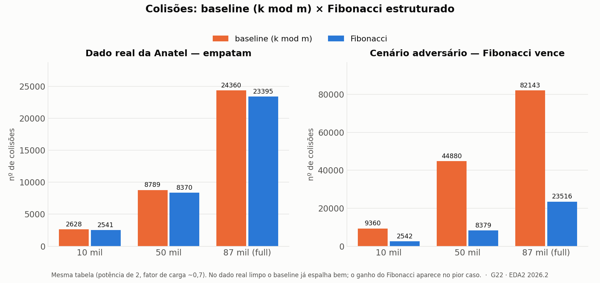

# G22_Busca_EDA2-2026.2 — Autenticador de Homologação Anatel

**Disciplina:** Estruturas de Dados 2 (EDA2) - 2026.2
**Professor:** Maurício Serrano
**Trabalho:** T1 - Algoritmos de Busca
**Dupla:** Anna Clara Cardoso Evangelista Brandão (222006354) e Esdras de Sousa Nogueira (222006230)
**Repositório:** `github.com/eda2-2026/G22_Busca_EDA2-2026.2`

---

## 1. Problema

Aparelhos de telecomunicação vendidos no Brasil precisam ser homologados pela Anatel, e cada um recebe um **número de homologação** de 12 dígitos no formato `HHHHH-AA-FFFFF`:

- `HHHHH` - número sequencial do produto no cadastro (5 dígitos);
- `AA` - ano da homologação (2 dígitos);
- `FFFFF` - identificação do fabricante (5 dígitos).

Produtos falsificados ou importados irregularmente frequentemente exibem números de homologação inexistentes ou trocados. Verificar a autenticidade é, na prática, um problema de **busca**: dado um número, ele existe no registro oficial e seus metadados (marca, modelo, fabricante) batem?

## 2. Como compilar e rodar

> **Pré-requisitos:** `gcc` e `make` — nada além da biblioteca padrão de C. No **Windows com MinGW**, use `mingw32-make` no lugar de `make`.

**Passo a passo** (a ordem importa — o passo 1 compila os binários que os outros usam):

```
make              # 1. compila TODOS os binarios em bin/
make test         # 2. testes  -> "RESULTADO: SUCESSO" + "rehashing preservou..."
make benchmark    # 3. mede baseline x Fibonacci -> resultados/colisoes.csv
make painel       # 4. mostra o resumo do experimento no terminal
```

Verificar números contra o registro real (depois do passo 1):

```
./bin/verificador --csv dados/registro_real.csv 00003-11-06559 12345-99-00000
#  00003-11-06559 -> GENUINO   |   12345-99-00000 -> FALSO
#  (no Windows: .\bin\verificador.exe --csv dados\registro_real.csv ...)
```

**Alvos disponíveis:**

| Alvo | O que faz |
| --- | --- |
| `make` | compila todos os binários em `bin/` |
| `test` | compila e roda os testes automáticos (parse + tabela) |
| `verificar` | verificador interativo (GENUÍNO / FALSO / INVÁLIDO) |
| `benchmark` | mede baseline × Fibonacci e gera `resultados/colisoes.csv` |
| `painel` | mostra o painel de resultados no terminal |
| `cli` | CLI de teste do parser do número |
| `importar` | driver de importação do CSV bruto da Anatel |
| `clean` | limpa a pasta `bin/` |

Para regerar o gráfico do experimento (requer `matplotlib`): `python resultados/gerar_graficos.py`.

## 3. O que o software faz

Verificador em linha de comando. Ele carrega o registro (um CSV de números válidos) numa tabela hash e responde, para cada consulta:

```
$ ./verificador --csv dados/registro_real.csv 03340-19-04952 99999-99-99999 abcde-19-04952
  "03340-19-04952"  ->  GENUINO   (encontrado no registro)
  "99999-99-99999"  ->  FALSO     (formato ok, mas nao esta no registro)
  "abcde-19-04952"  ->  INVALIDO  (fora do formato HHHHH-AA-FFFFF)
```

Três respostas: **GENUÍNO** (bem formado e presente no registro), **FALSO** (bem formado, mas ausente) e **INVÁLIDO** (nem está no formato).

Fluxo interno: (1) parse e validação de formato → (2) hash do número → (3) busca no bucket → (4) resposta.

## 4. Objetivo e contribuição

Construir um **verificador de homologação** que responde `GENUÍNO` / `FALSO` para um número informado, indexando o registro por uma **tabela hash**.

A contribuição do trabalho é **projetar uma função de hash sob medida para o formato da Anatel** (`HHHHH-AA-FFFFF`), que minimiza colisões em relação a uma função genérica, e **comprovar esse ganho com um experimento**. Como o registro não segue uma distribuição uniforme — anos e fabricantes se repetem e o número sequencial é denso, uma função ingênua concentra chaves em poucos buckets. Nosso índice explora a estrutura dos campos para espalhar melhor as chaves.

## 5. Núcleo técnico - a função de hash

O número cabe num inteiro de 64 bits (`~10¹² < 2⁴⁰`). Comparamos duas funções sobre a mesma estratégia de resolução de colisão (encadeamento), para que a diferença medida seja **só da função**.

### 5.1 Baseline: módulo simples

`h(k) = k mod m`. Serve de ponto de comparação: por olhar sobretudo os dígitos baixos da chave, tende a deixar a estrutura dos dados (como o agrupamento por fabricante) se refletir nos buckets.

### 5.2 Melhorada: Fibonacci estruturado

Combina os campos com primos distintos e aplica hashing multiplicativo de Fibonacci, que lê os **bits altos** do produto — dependentes de todos os bits da chave. Dissolve sequências e agrupamentos com 1 multiplicação + 1 shift.

```c
#include <stdint.h>

#define FIB64 0x9E3779B97F4A7C15ULL  // 2^64 / phi, ímpar

typedef struct { uint32_t seq; uint16_t ano; uint32_t fab; } Homolog;

// Chave inteira consciente do tipo: separa e mistura os campos
static inline uint64_t chave_estruturada(Homolog h) {
    uint64_t k = (uint64_t)h.seq * 1000003ULL;   // primo
    k ^= (uint64_t)h.ano * 19349663ULL;          // primo
    k ^= (uint64_t)h.fab * 83492791ULL;          // primo
    return k;
}

// Hash de Fibonacci: m = log2(tamanho da tabela), lê os m bits altos
static inline uint64_t hash_fib(uint64_t k, uint32_t m) {
    return (k * FIB64) >> (64 - m);
}

// Baseline ingênuo, para comparação
static inline uint64_t hash_mod(uint64_t k, uint64_t tam) {
    return k % tam;
}
```

### 5.3 Estático × dinâmico

- **Estático:** o registro é um conjunto conhecido, ou seja, dá para construir um hash quase perfeito (colisões ≈ 0).
- **Dinâmico:** novas homologações entram com o tempo, ou seja, tabela crescível com **rehashing** ao ultrapassar o fator de carga. Medimos o custo de manter o desempenho conforme a base cresce.

## 6. Experimento

Datasets do mesmo tamanho:

- **real** - amostra de números da Anatel (distribuição agrupada);
- **sintético uniforme** - grupo de controle, para mostrar o teto de qualidade;
- **consultas falsas** - números inexistentes, gerados contra o próprio registro real (pior caso: confirmar ausência).

Tamanhos: **10k / 50k / 87k** (a base real, depois de deduplicada, tem 87.263 números distintos). Métricas medidas para cada função:

- número total de **colisões**;
- **maior bucket** e **variância** do tamanho dos buckets (o quanto agrupa);
- **fator de carga** na hora da medição;
- **tempo médio** e **tempo de pior caso** de consulta;
- **custo de construção** (e de rehashing, no dinâmico).

Saída: `resultados/colisoes.csv` + gráficos comparando baseline × Fibonacci.

## 7. Resultados

Medimos duas funções de hash — **baseline** (`k mod m` sobre o número bruto) e **Fibonacci** (chave estruturada + multiplicative-shift) — na mesma tabela (potência de 2, fator de carga ~0,7), em dois cenários: o **registro real** da Anatel e um **adversário** construído de propósito (poucos anos/fabricantes, sequencial denso — o pior caso da função ingênua).

### 7.1 Um achado no caminho: duplicatas

O CSV bruto da Anatel tem **189.317 linhas, mas só 87.263 números distintos** — o mesmo número de homologação aparece em várias linhas (é um log de certificações, não um registro limpo). Como número repetido colide em qualquer hash, as duplicatas dominavam a medição. Por isso o importador **deduplica** (o registro é um conjunto): o experimento roda sobre os 87.263 distintos.

### 7.2 Baseline × Fibonacci

| cenário | função | colisões | maior bucket |
| --- | --- | ---: | ---: |
| real (87k) | baseline | 24.360 | 8 |
| real (87k) | Fibonacci | 23.395 | 7 |
| adversário (87k) | baseline | **82.143** | 18 |
| adversário (87k) | Fibonacci | 23.516 | 8 |



**Leitura:** no **dado real limpo**, baseline e Fibonacci **empatam** — os números de homologação da Anatel *não* têm o agrupamento de baixo nível que a proposta imaginava; o `k mod 2^m` já espalha quase idealmente (os dois ficam perto do hashing aleatório ideal). O ganho do Fibonacci **só aparece quando o dado realmente agrupa**: no cenário adversário o baseline colapsa (usa ~4% dos buckets, 82.143 colisões) e o Fibonacci se mantém perto do ideal (23.516) — ~3,5× menos colisões.

### 7.3 Conclusão

Escolhemos o **Fibonacci** não porque o dado real exija, mas pela **robustez**: ele iguala o baseline no caso fácil e o supera com folga no pior caso, ao custo de uma multiplicação e um shift. E há um resultado metodológico que vale registrar: *medir* revelou que a hipótese inicial (o dado real agruparia) estava errada, e que a maior fonte de colisões era a duplicação — corrigida na deduplicação.

Os números vêm de `resultados/colisoes.csv` (gerado por `make benchmark`); o gráfico, de `resultados/gerar_graficos.py`; e há um resumo colorido no terminal em `make painel`.

## 8. Análise de complexidade

| Função | Tempo médio | Pior caso | Espalhamento nos dados reais |
| ------ | ----------- | --------- | ---------------------------- |
| `k mod m` (baseline) | O(1) | O(n) | ruim — estrutura vaza p/ buckets |
| Fibonacci estruturado | O(1) | O(n) | bom — difunde ano/fabricante/sequencial |
| Hash perfeito (estático) | O(1) | O(1) | ideal — colisão zero no conjunto conhecido |

Referências para a discussão (por que não usamos): busca binária exige vetor ordenado e dá O(log n); interpolação chega a O(log log n) só em dados uniformes - que a Anatel não é.

## 9. Estrutura de pastas

```
G22_Busca_EDA2-2026.2/
├── README.md
├── Makefile                       # cross-platform (make / mingw32-make)
├── .gitattributes                 # normaliza fim de linha (LF)
├── dados/
│   ├── registro_real.csv          # 87.263 numeros distintos (deduplicado)
│   ├── registro_sintetico_pequeno.csv   # amostra uniforme (controle)
│   └── consultas_falsas_pequeno.csv     # amostra de numeros inexistentes
├── src/
│   ├── homolog.h / homolog.c      # parse e formatacao do numero
│   ├── homolog_test.c             # testes do parse
│   ├── homolog_cli.c              # CLI de teste do parse
│   ├── hash.h / hash.c            # hash_mod (baseline) + chave_estruturada + hash_fib
│   ├── hash_test.c               # compara hash_mod x hash_fib (amostra agrupada)
│   ├── tabela.h / tabela.c        # tabela hash dinamica (encadeamento) + rehashing
│   ├── tabela_test.c              # testes da tabela
│   ├── verificador.c              # CLI: numero -> GENUINO/FALSO/INVALIDO
│   ├── benchmark.c               # mede baseline x Fibonacci -> colisoes.csv
│   ├── painel.c                  # painel de resultados no terminal
│   ├── gerador.h / gerador.c      # datasets: sintetico, importacao real, consultas falsas
│   └── importar.c                 # driver do importador do dado real
├── resultados/
│   ├── colisoes.csv               # metricas medidas
│   ├── gerar_graficos.py          # gera os graficos a partir do CSV
│   └── graficos/                  # PNGs gerados (baseline_vs_fibonacci.png)
└── docs/
```
## 10. Vídeo de apresentação

[](https://www.youtube.com/watch?v=ifjD-_IkMQc)

## 11. Bibliografia

- Drozdek, A. *Data Structures and Algorithms in C++*, 2ª ed., Brooks/Cole, 2001.
- Weiss, M. A. *Data Structures and Algorithm Analysis in C++*, 3ª ed., Addison Wesley, 2006.
- Cormen, T. H. et al. *Introduction to Algorithms*, 3ª ed., MIT Press, 2009. (cap. de hashing)
